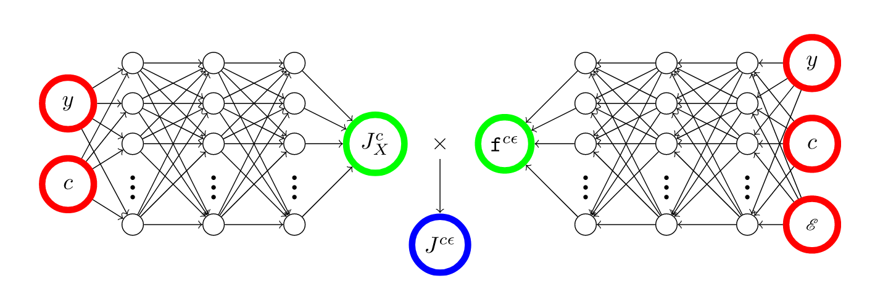

En théorie de la fonctionnelle de la densité, le terme cruciale à approximer est l'énergie d'échange-corrélation ($E_{xc}$). 
Cette énergie est normalement séparée en un terme d'échange et de corrélation,
$$E_{xc}=E_x+E_c$$
où l'échange est reliée à la répulsion de Pauli, qui indique que deux électrons de mêmes spins ne peuvent pas se situer au même endroit dans l'espace. La corrélation est reliée à l'intéraction coulombique entre les électrons
Une approche pour parvenir à calculer $E_{xc}$ est de construire des approximations du trou d'échange corrélation $\rho_{xc}(\mathbf{r},u)$ qui correspond à la diminution de la densité de probabilité de trouver un électron à une distance $u$ lorsqu'il y a un électron de référence à une position $\mathbf{r}$.
# Facteur de corrélation
L'approche conventionnelle est de d'addition un trou d'échange avec celui de corrélation,
$$\rho_{xc}(\mathbf{r},u)=\rho_x(\mathbf{r},u)+\rho_{c}(\mathbf{r},u)$$
Dans le groupe, nous avons développer un facteur de corrélation,
$$\rho_{xc}(\mathbf{r},u)=f_c(\mathbf{r},u)\rho_x(\mathbf{r},u)$$
Cette approche a l'avantage de faciliter la construction de la contribution de la corrélation, grâce à de multiples contraintes physiques ou mathématiques connues. Nous avons d'ailleurs utiliser des réseaux de neurones pour faciliter la construction de trou d'échange-corrélation($J$ est un trou réduit, qui ne dépend pas de la densité électronique).

  

